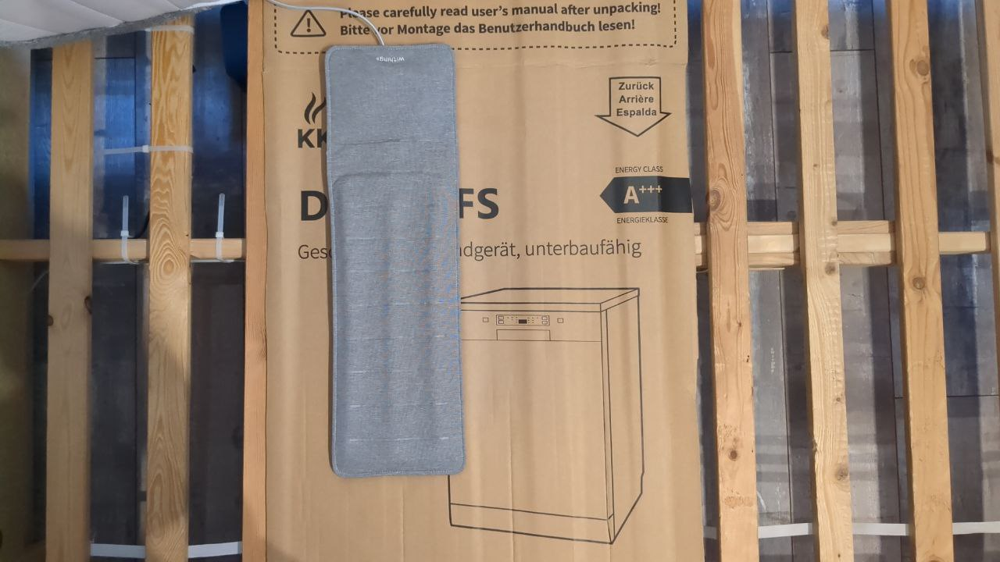
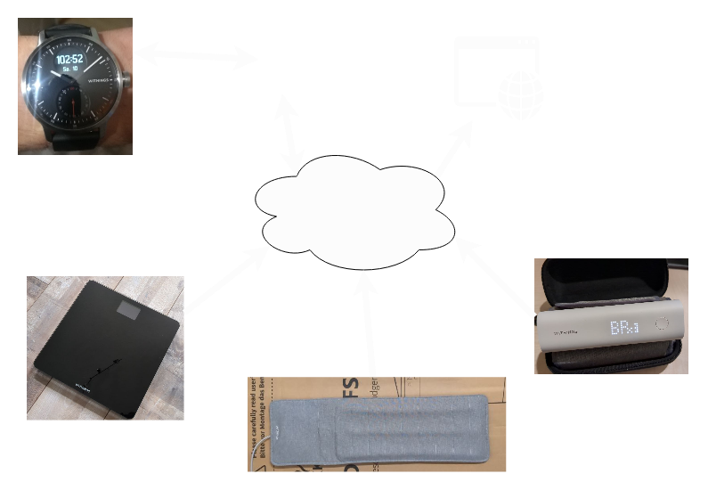
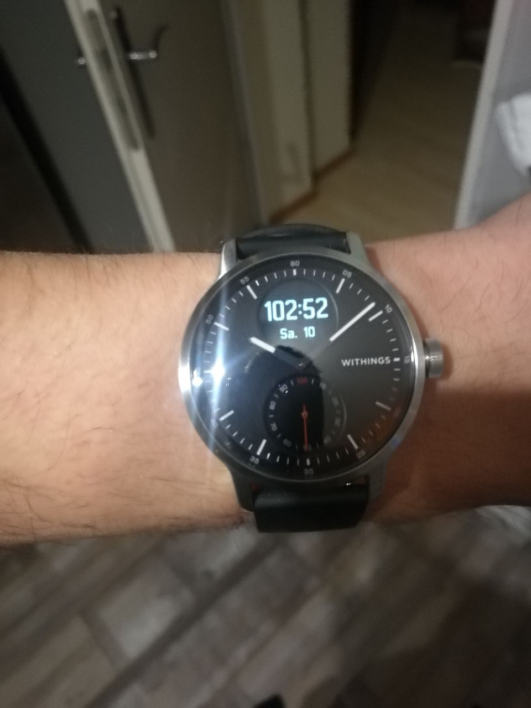
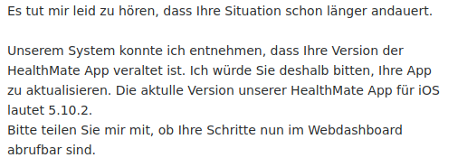

## 

## Overview
  - System that I use.
  - Where did I have problems?
  - Fix

## Withings
  - Some smart health devices 
  - Track some vital parameters
  - Possibility to access via app or website

Does anyone know them?

### Sleep Analyzer

### scale

### Blood pressure monitor

### Watch

### Layout

## What is your problem?

### Is the clock running wrong?

Yes, but that's not my problem.

### Heatmap

## contact support  

### 1. Advice: Charge your Watch

### 2. Advice: Update your app

### I gave up

## Fix

### Easy fix

### Best fix 
- After almost a year, the heatmap is back.
- And it works again.

### My fix
A small smart phone widget or addon for the taskbar.

## Thank you for your attention
Do you know other systems that might work better (preferably cloud loose)?
