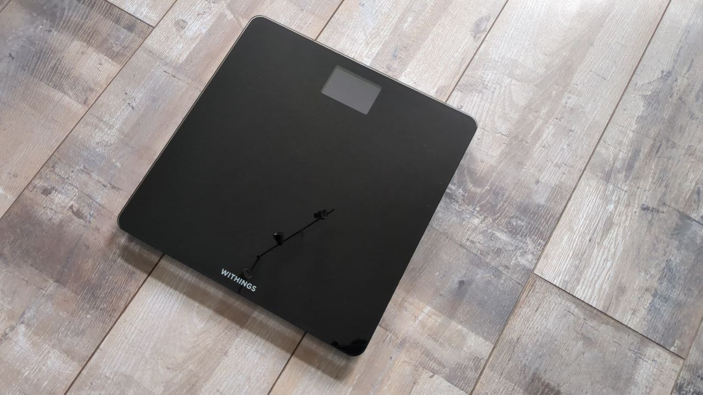
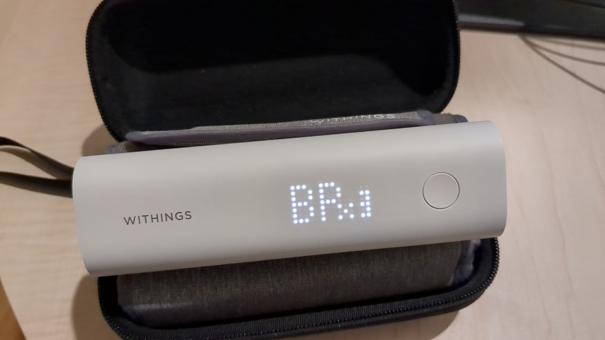
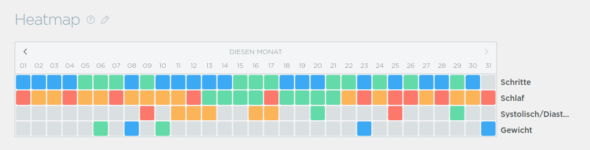
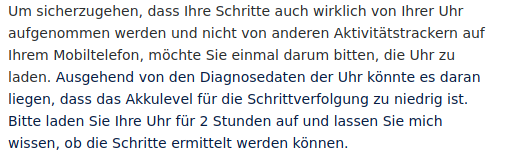

## 

## Overview
  - System that I use.
  - Where did I have problems?

## Withings
  - Some smart health devices 
  - Track some vital parameters
  - Possibility to access via app or website

### Sleep Analyzer

### scale

### Blood pressure monitor

### Watch

### Layout

## What is your problem?

### Is the clock running wrong?

Yes, but that's not my problem.

### Heatmap

## contact support  

### 1. Advice: Charge your Watch

### 2. Advice: Update your app

### 

## Fix

### 

### After almost a year, the heatmap is back.
